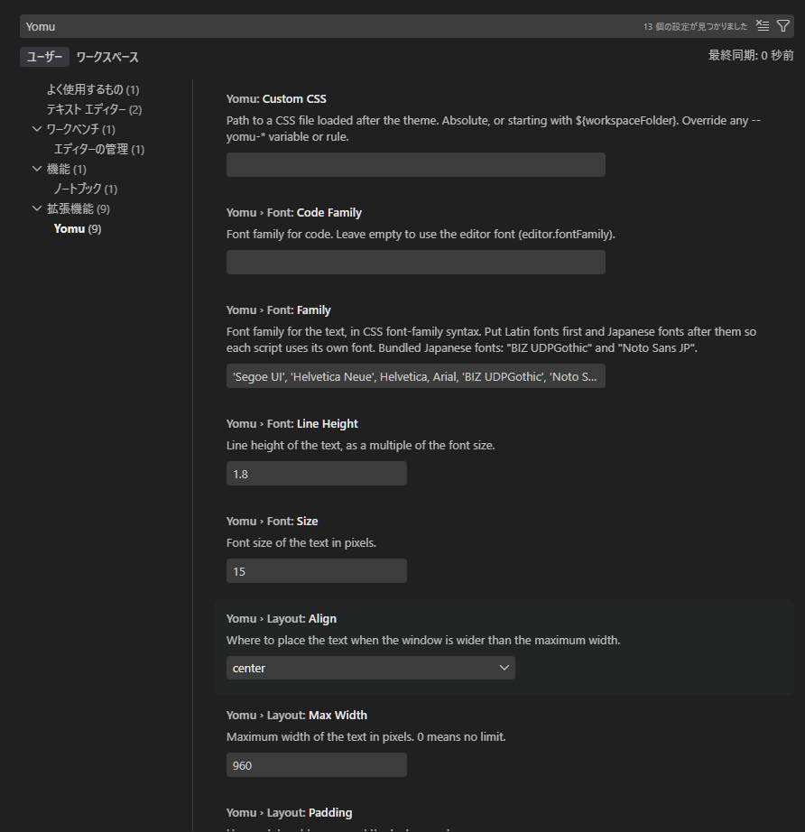

# Yomu - Markdown Reader with Japanese Typography

[](https://github.com/shou6/yomu/actions/workflows/ci.yml)

[日本語](README.ja.md)

Yomu opens a Markdown file in a dedicated reader tab, typeset for reading Japanese text.
It is a viewer, not an editor: when you want to edit, open the file in the regular text editor.


## Features

- **Reader tab**: opens `.md` files as a custom editor tab. The default editor stays untouched; open the reader explicitly from the book icon in the editor title bar, the Command Palette, or "Reopen Editor With...".
- **Japanese typography**: separate fonts for Japanese and Latin text, comfortable line height, and tighter spacing around Japanese punctuation. Two Japanese fonts are bundled, so the text looks the same on every OS.
- **Rendering**: CommonMark plus GFM tables, strikethrough and task lists, syntax highlighting for code blocks, Mermaid diagrams, heading anchors, local and remote images. Raw HTML is disabled.
- **Themes**: `paper` (white page), `sepia`, `dark`, and `vscode` (follows your color theme). All share the same structure: clear heading levels, tables with horizontal rules, and soft code blocks.
- **Live update**: editing and saving the file in the text editor updates the reader tab.

## Usage

1. Open a `.md` file.
2. Click the book icon in the editor title bar, or open the Command Palette (`Ctrl+Shift+P` / `Cmd+Shift+P`) and run **Yomu: Open in Reader**.
   You can also use **Reopen Editor With...** and choose **Yomu Reader**.
3. To edit, use **Reopen Editor With...** and choose **Text Editor**.


## Settings

All settings start with `yomu.` and apply to open reader tabs immediately.

| Setting | Default | What it does |
| --- | --- | --- |
| `yomu.theme` | `paper` | Color theme: `paper` (white page), `sepia` (warm page), `dark`, or `vscode` (follows your VS Code theme). High-contrast VS Code themes always use the VS Code colors. |
| `yomu.layout.maxWidth` | `820` | Maximum width of the text in pixels. `0` means no limit. |
| `yomu.layout.align` | `center` | Where the text sits when the window is wider: `left`, `center`, or `right`. |
| `yomu.layout.padding` | `32` | Horizontal padding around the text in pixels. |
| `yomu.font.family` | Latin fonts, then Japanese fonts | CSS `font-family` for the text. Put Latin fonts first and Japanese fonts after them so each script uses its own font. |
| `yomu.font.codeFamily` | (empty) | Font for code. Empty means a Japanese monospace font with an exact 1:2 width ratio (BIZ UDGothic, Osaka-Mono, Noto Sans Mono CJK JP), with box-drawing characters narrowed to half width, so text diagrams line up even with Japanese in them. |
| `yomu.font.size` | `16` | Font size in pixels. |
| `yomu.font.lineHeight` | `1.8` | Line height as a multiple of the font size. |
| `yomu.customCss` | (empty) | Path to a CSS file loaded after the theme. Absolute, or starting with `${workspaceFolder}`. Saved changes apply immediately. |



### Themes


### Bundled fonts

Two Japanese fonts ship with the extension, under the SIL Open Font License. Use their names in `yomu.font.family`:

- `BIZ UDPGothic` (Morisawa): a universal-design gothic made for legibility. Regular and Bold.
- `Noto Sans JP` (Google): a variable font with weights 100 to 900.

The default puts Latin fonts first and `Noto Sans JP` after them. To use a bundled font for everything, put it first:

```json
"yomu.font.family": "'BIZ UDPGothic', sans-serif"
```

### Custom CSS

Every color is a CSS variable on `body`, so a small file is enough to restyle the reader:

```css
body {
  --yomu-link: rebeccapurple;
  --yomu-h2-border: #888;
}
```

Variables:

- Page: `--yomu-bg` `--yomu-fg` `--yomu-link` `--yomu-hr`
- Headings: `--yomu-h1` to `--yomu-h5`, `--yomu-h1-border` to `--yomu-h3-border`
- Tables: `--yomu-th` `--yomu-th-border` `--yomu-td-border` `--yomu-row-hover`
- Code: `--yomu-pre-bg` `--yomu-pre-border` `--yomu-code-bg` `--yomu-code-fg` `--yomu-code-label-fg` `--yomu-code-label-bg`
- Quotes: `--yomu-quote-border` `--yomu-quote-bg` `--yomu-quote-fg`
- Syntax highlighting: `--yomu-hl-keyword` `--yomu-hl-string` `--yomu-hl-number` `--yomu-hl-comment` `--yomu-hl-function` `--yomu-hl-type` `--yomu-hl-variable` `--yomu-hl-attr` `--yomu-hl-meta`

Any other rule works too. The text lives in `<main id="content">`, and code blocks with a language are wrapped in `<div class="yomu-code" data-lang="…">`.

## Requirements

- Visual Studio Code 1.138 or later

## License

[MIT](LICENSE)
